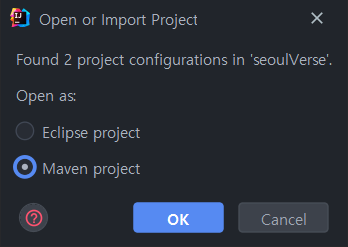

[설치해야 할 프로그램]
1. 자바 설치 8버전
2. node 설치
3. postgresql 설치(로컬 테스트)

<hr/>

[사용한 툴]
1. intellij
2. dbeaver
3. source tree나 toltoise git  

<hr/>

[git 주소]
```
git clone  http://115.178.73.117:30000/scm/git/seoul_dev_2022
```

<hr/>

[설치 방법]

소스를 체크아웃 한 이후에 seoulVerse 폴더로 들어온다.  
인텔리J를 사용할 경우 메이븐 프로젝트 혹은 이클립스 프로젝트 인지를 물어보는 데 메이븐 프로젝트를 선택한다. <br/>


메이븐 플러그인에서 다운로드 소스 후 리프레시를 한다. <br/>
(개인이 가지고 있는 플러그인에 따라 자동으로  설치되고 리프레시 되기도 한다.)


터미널로 seoulVerse\src\main\webapp 루트로 들어간다.

```
npm install
```
을 실행해 자바스크립트 라이브러리를 설치한다.설치가 완료 되면 아래 구문을 실행한다.
```
npm run dev
```
해당 스크립트는 웹팩의 watch를 적용해서 스크립트 수정시 바로 패킹을 하게 된다.

seoulVerse\src\main\java\egovframework\EgovBootApplication.java
에 run 하게 되면 해당 서비스가 실행된다.

http://localhost:8080/admin/login 이 정상적으로 구동이 되면 개발환경 설정완료<br/>
로그인은 DATABASE 폴더에 있는 Data_postgresql.sql을 참고해 데이터를 만들거나 향후에
접속하게 될 개발 DB 접속 정보를 변경하면 된다.


